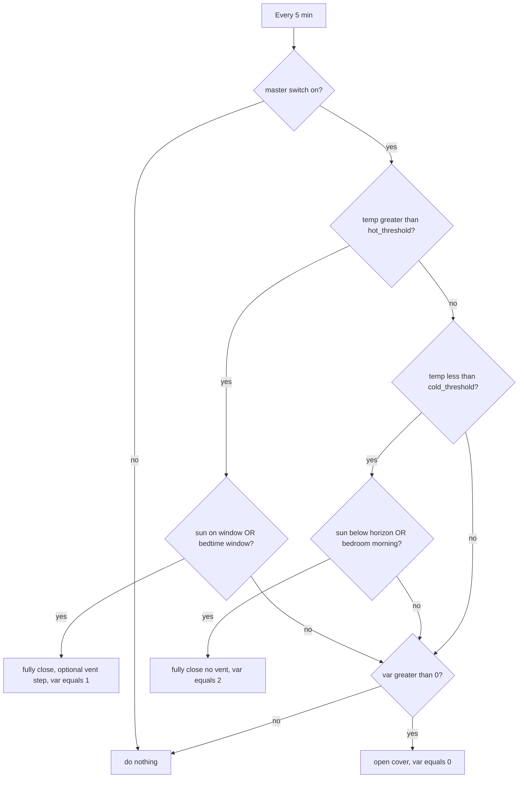

# cover_control

Unified Home Assistant blueprint for automated shutter / cover control with three goals:

1. **Summer heat protection** — close when the sun hits the window AND it's hot outside.
2. **Winter night insulation** — close at night when it's cold outside (windows are the biggest heat-loss surface).
3. **Bedroom morning protection** — keep bedroom shutters closed past sunrise so the morning sun (and the shutter motor) doesn't wake you up.

Plant rooms get heat protection without losing daylight via the **vent position trick**: the shutter fully closes (compressing the slats) and then lifts by 1 %, opening tiny horizontal slits between every slat that let diffuse light through across the entire window.

## Files

- `cover_control.yaml` — the unified blueprint.

## Inputs

| Input | Default | Purpose |
|---|---|---|
| `cover_entity` | required | The shutter to control |
| `temperature` | required | Weather entity that provides outdoor temperature |
| `sun_position_start` | 89° | Azimuth where sun starts hitting the window |
| `sun_position_end` | 200° | Azimuth where sun stops hitting the window |
| `sun_elevation_start` | 32° | Elevation above which the sun is high enough to matter |
| `hot_threshold` | 20 °C | Outdoor temp above which heat-protection close is active |
| `cold_threshold` | 8 °C | Outdoor temp below which night-insulation close is active |
| `enable_vent_position` | false | Plant rooms: lift to vent position after closing in hot mode |
| `vent_position` | 1 | How far to lift (smaller = tighter slits) |
| `enable_bedtime_close` | false | Bedrooms: force closed during the bedtime window |
| `bedtime_close_at` | 20:00:00 | Start of bedtime window (hot mode) |
| `bedtime_open_at` | 11:00:00 | End of bedtime window (hot mode), and morning open boundary in cold mode |

## Per-room recipes

### Living room

Heat-protection close when sun hits, night insulation close when it's cold outside.

| Setting | Value |
|---|---|
| `enable_vent_position` | `false` |
| `enable_bedtime_close` | `false` |

### Bedroom

Like the living room, plus:
- Stays closed 20:00 → 11:00 in hot mode so the morning sun doesn't wake you.
- In cold mode, opens at `bedtime_open_at` (11:00) instead of sunrise so the shutter motor doesn't run before you're up.

| Setting | Value |
|---|---|
| `enable_vent_position` | `false` |
| `enable_bedtime_close` | `true` |
| `bedtime_close_at` | `20:00:00` |
| `bedtime_open_at` | `11:00:00` |

### Plant room

Hot-mode close uses the vent position so plants still get distributed diffuse light across the whole window. Cold-mode close stays a full close (plants don't need light at night, max insulation wins).

| Setting | Value |
|---|---|
| `enable_vent_position` | `true` |
| `vent_position` | `1` |
| `enable_bedtime_close` | `false` |

## Master switch

The automation is gated on `input_boolean.cover_manage_cover_with_sun`. Turn it off to disable all cover automation globally.

## Per-cover state tracking

Each cover has a corresponding `var.<cover_name>` (using the [`var` HACS integration](https://github.com/snarky-snark/home-assistant-variables)) that tracks whether the shutter is currently auto-closed:

- `0` — open / not auto-closed
- `1` — auto-closed by hot mode (possibly with vent slit)
- `2` — auto-closed by cold mode (fully closed for max insulation)

The var is set **before** the motor command, so manual interrupts (stop or reverse mid-move) are respected — the next 5-minute tick won't re-trigger the same close. The vent step is also gated on the actual final position so it never fights a manual stop.

## Behaviour

## Migration notes

This blueprint replaces the previous `cover_control_basic.yaml`, `cover_control_dark.yaml`, and `cover_control_sleep.yaml`. After updating, re-create your per-cover automations using the recipes above. The `var.<cover>` entities keep working — they just gain a `2` state value for cold mode.
